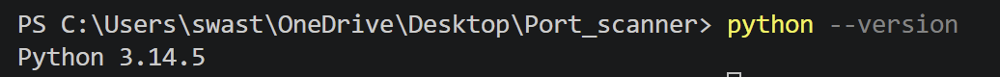
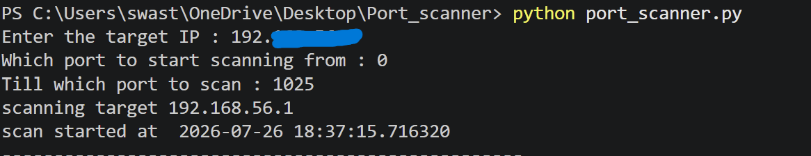

# Threaded Port Scanner 

# Description 
This is a simpple port scanner which scans ports of a target machine as inputted by the user and notifies if any port is active. It makes use of techniques like multithreading to accelerate the process of the scan.  

# Purpose 
I created this project to deepen my understanding of sockets , TCP connections and multithreading. 
The portscanner was a practical and pundamental project to better understand the basics of networks. 

# How it works 
1. The portscanner , on execution, first asks for the user input for the target ip address (IPv4).

2. Then it asks for two more fields as user input, thw port from where to start the scan and the port till which to scan.

3. Finally it creates a sockets which communicates via TCP and sends a connect req to the target ip on random ports between the starting and the ending ports in groups of 10.

4. If the connection is established without any error the program returns the port on which it has been established. 

# Installation 

1. Download python 

2. Clone the repository 

3. Change directories 

# Usage 

Once you are in the required directory, the program can be executed using the following code : 

